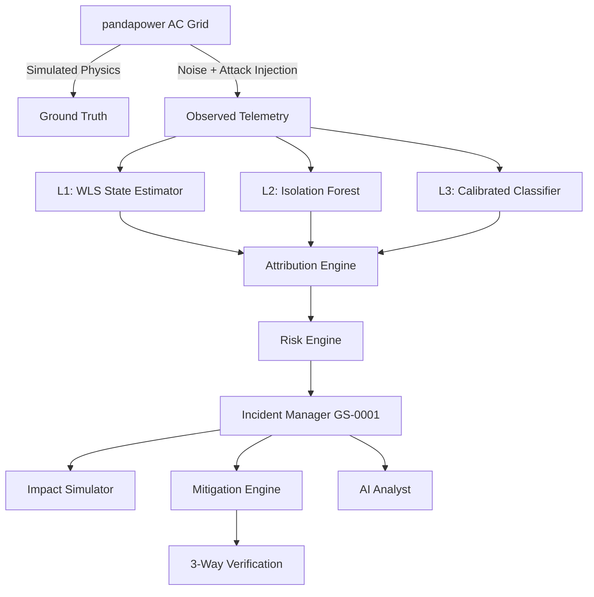

# GridShield AI — Architecture & System Design

## Overview
GridShield AI is organized around strict contract-first principles, full provenance traceability, and a ground-truth isolation firewall.

---

## 1. Ground-Truth Isolation Firewall (Invariant I3)
To ensure machine learning and statistical detection are genuinely evaluated without data leakage:
- **`GroundTruthPoint`**: Kept in the simulation engine. Contains true physical voltages, branch currents, generator powers, and ground-truth scenario labels.
- **`ObservedTelemetryPoint`**: The only input passed to SCADA state estimation, L1/L2/L3 detectors, and attribution. Contains noisy measurements, reported timestamps, and sensor quality codes.
- **Firewall Import Test**: `backend/tests/test_m2_attacks_and_isolation.py` enforces AST checks guaranteeing that `backend/app/detection/`, `backend/app/attribution/`, and `backend/app/risk/` cannot import `GroundTruthPoint` or simulator internals.

---

## 2. In-Process Attack Engine (Invariant I9)
Attacks are strictly in-process simulated objects (`backend/app/attacks/`):
- **False Data Injection (FDI)**: Modifies `reported_value` with configurable bias, scale factor, or ramp.
- **Malicious Control Command**: Dispatches unauthorized AVR voltage setpoints or breaker trip signals into the simulated SCADA channel.
- **Replay**: Replays stale telemetry frames while preserving outdated timestamps.
- **Denial of Service (DoS)**: Simulates packet dropout and telemetry loss (`TelemetryQuality.MISSING`).
- **Isolation Test**: Tests verify that `attacks/` has no imports of `socket`, `requests`, `httpx`, `urllib`, or `scapy`.

---

## 3. Layered Intelligence Pipeline (L1 - L3)

| Layer | Algorithm | Input | Function | Output |
|---|---|---|---|---|
| **L1** | WLS State Estimator + Chi-Square | Raw Telemetry (`v_pu`, `p_mw`, `q_mvar`) | Classical bad data detection | Normalized residuals, flagged meters |
| **L2** | Isolation Forest | 14 Engineered features (voltage deviations, residuals, rate-of-change, cyber counts) | Unsupervised anomaly scoring | Anomaly score, binary flag |
| **L3** | Calibrated HistGradientBoosting | Feature vector | Supervised multi-class attack classification | Calibrated class probabilities (`NORMAL`, `PHYSICAL_FAULT`, `FALSE_DATA_INJECTION`, `MALICIOUS_CONTROL_COMMAND`, `REPLAY`, `DENIAL_OF_SERVICE`) |

---

## 4. Multi-Hypothesis Attribution Engine
Attribution assesses 4 candidate hypotheses:
1. `H_normal`: High probability when telemetry is within nominal noise envelope and zero cyber events.
2. `H_physical`: Supported when candidate physical fault simulation (N-1 line outage or generator redispatch) reproduces the observed pattern with low residual AND neighboring buses show coherent electrical propagation.
3. `H_cyber`: Supported when single-sensor voltage disagreement is high, physical explainability fails, and/or cyber authentication anomalies exist.
4. `H_cyberphysical`: Supported when unauthorized control commands precede genuine physical voltage shifts.

---

## 5. Closed-Loop SCADA Supervisory Controller
Unlike static power flow models, GridShield features closed-loop SCADA dynamics:
1. Supervisory controller reads **estimated state** from noisy/manipulated telemetry.
2. Under an FDI attack falsely lowering Bus 4 voltage, the controller commands Gen 2 AVR to over-excite, driving the **true grid voltage** into dangerous over-voltage (> 1.08 p.u.).
3. The mitigation engine restores stability by quarantining the compromised sensor and re-estimating state from clean redundant measurements.

---

## 6. End-to-End Resilience Loop

